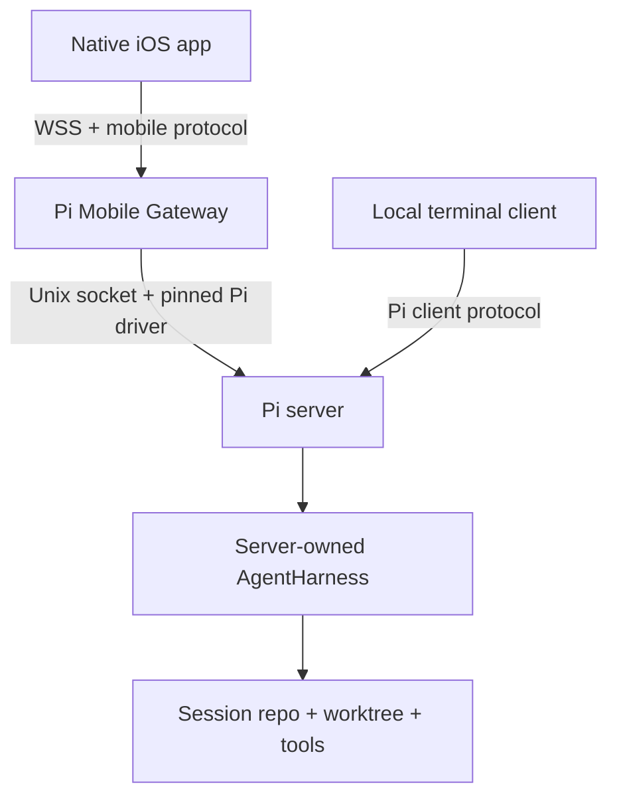
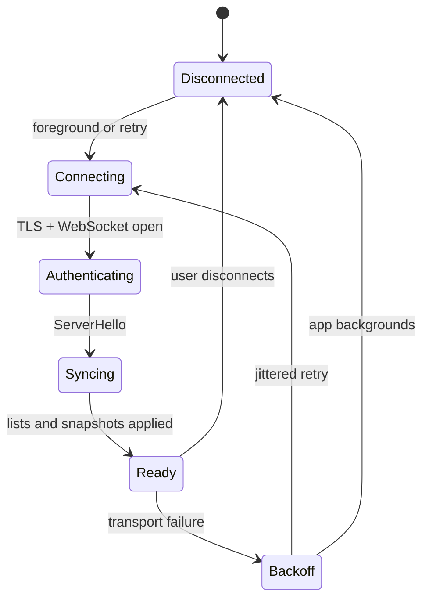

# Architecture: Native iOS companion for the Pi coding-agent server

**Status:** proposed architecture  
**Research date:** 2026-08-13  
**Upstream baselines:** published Pi `main` at
`9d2ec7ffabe927bfad2214c1cee25b6632a78dcf` (`@earendil-works/pi-server` 0.84.1),
and the actively changing replacement on `dev` at
`ce142b2a69dadcba08f9138961a31206a7cb4f71`. The published package identifies
itself as experimental, and Pi explicitly gives its protocol no compatibility
guarantees. [PI-084-PACKAGE] [PI-084-PROTOCOL] [PI-DEV-PROTOCOL]

In this document, **MUST**, **SHOULD**, and **MAY** are architectural decisions,
not claims about existing software. Factual statements about Pi, iOS, Swift, or
the Claude reference product carry an inline upstream documentation or
source-code citation.

## 1. Executive summary

Build a native SwiftUI iOS app that remotely views and steers coding-agent
sessions whose process, repository, filesystem, tools, credentials, and model
connection remain on the user's Pi host. This matches the important property of
Claude Code Remote Control: the mobile surface is a window into a session still
running on the user's machine, rather than a second cloud-hosted agent.
Anthropic documents synchronized terminal/mobile interaction, reconnection after
interruption, and local execution/filesystem access for that model.
[CLAUDE-REMOTE]

The system has three required deployable components:

1. **Pi server/runtime host.** Owns each live `Session` and `AgentHarness`;
   local terminal clients and remote clients attach to that server-owned
   runtime.
2. **Pi Mobile Gateway.** Runs beside Pi, connects over Pi's Unix socket,
   absorbs Pi's experimental protocol churn, authenticates mobile devices, and
   exposes a stable binary WebSocket API.
3. **Pi Mobile for iOS.** A native Swift app using SwiftUI, Swift Concurrency,
   `URLSessionWebSocketTask`, SwiftProtobuf, Keychain Services, and an encrypted
   local cache. Apple's WebSocket API is a message-oriented transport over
   TCP/TLS, and SwiftProtobuf provides schema-generated Swift value types plus
   compact binary serialization. [APPLE-WEBSOCKET] [SWIFT-PROTOBUF]

The iOS app does **not** embed Pi, execute shell commands, mount the repository,
or hold model-provider credentials. It displays semantic agent state and submits
typed control operations. Tool execution remains entirely within the host's
existing Pi policy and tool configuration.



## 2. The critical upstream constraint

There are currently two materially different upstream server designs:

| Baseline                      | What exists upstream                                                                                                                                                                                                               | Architectural consequence                                                                                                                                                                                  |
| ----------------------------- | ---------------------------------------------------------------------------------------------------------------------------------------------------------------------------------------------------------------------------------- | ---------------------------------------------------------------------------------------------------------------------------------------------------------------------------------------------------------- |
| Published `main`, v0.84.1     | Protocol v1 has list/create/attach/detach, prompt/steer/abort, model and thinking changes, authoritative session snapshots, and transient transcript-progress events. [PI-084-SCHEMAS]                                             | Sufficient for a first full-control prototype if the gateway pins this exact package set.                                                                                                                  |
| Current `dev` replacement     | Protocol v1 currently exposes only `list()` and `attach(sessionId)`; `attach` returns only a session ID. Upstream says remote `Session` and `AgentHarness` methods will arrive in a later slice. [PI-DEV-PROTOCOL] [PI-DEV-CLIENT] | Not sufficient today for a Claude-like mobile client. The gateway must advertise only capabilities actually present, and full-control release must wait for or contribute the missing Harness RPC surface. |
| Current `dev` CLI composition | The coding-agent server is explicitly a temporary in-memory list-and-attach demo; its entry point rejects authentication and custom listeners. [PI-DEV-RUNTIME] [PI-DEV-MAIN]                                                      | It is not a production remote host. A real launcher must supply the durable session repository, complete Harness factory, authentication, and network gateway.                                             |

Both incompatible schemas still call themselves protocol version `1`; the
integer alone therefore cannot select a safe adapter. [PI-084-PROTOCOL]
[PI-DEV-PROTOCOL]

The `dev` direction is nevertheless the correct ownership model: concurrent
attachments reuse one hosted Harness, a client disconnect removes only that
attachment, and the Harness remains alive until server shutdown. [PI-DEV-SERVER]
[PI-DEV-HOSTED] That is the prerequisite for genuinely continuing one session
from a terminal and a phone.

Therefore:

- The App Store client MUST speak only the stable **Pi Mobile Protocol**, never
  an unversioned Pi wire format.
- The gateway MUST contain replaceable, version-pinned `PiDriver` adapters.
- The production target SHOULD be the new server-owned Harness architecture, not
  a remote façade over an independently running terminal process.
- A normal terminal session is remotely continuable only when its Harness is
  owned by the server or explicitly handed off to it. Attaching to the same
  JSONL file from a second, separately owned runtime is not considered
  continuation.

## 3. Product scope

### 3.1 Version 1

Version 1 MUST provide:

- pair, list, revoke, and reconnect to one or more user-configured Pi hosts;
- list durable sessions and attach to an existing session;
- render the authoritative transcript plus live assistant, thinking, tool-call,
  tool-result, retry, and phase updates;
- submit a new prompt while idle, steer an active turn, and abort an active
  operation;
- select model and thinking level only when the host advertises those
  capabilities and the session is in a legal state;
- survive Wi-Fi/cellular transitions and process interruption by reconnecting
  and fetching a new authoritative snapshot;
- cache session metadata and previously seen transcript data for fast launch and
  offline reading;
- notify the user when a long run finishes or needs supported user action; and
- expose precise online, reconnecting, stale-cache, and delivery-unknown states.

The published Pi client already models prompt-vs-steer submission based on
whether the session is idle or in a turn, restricts model/thinking changes to
idle, and explicitly reacquires the session after reconnect.
[PI-084-REMOTE-SESSION] The mobile UI SHOULD make the prompt/steer distinction
visible instead of silently changing semantics beneath one identical send
button.

### 3.2 Explicit non-goals

Version 1 does not include:

- a terminal emulator, SSH client, remote desktop, general file browser, or
  source editor;
- running Pi or model-provider calls on the phone;
- creating a new session from the phone;
- image/file upload;
- arbitrary extension UI;
- multi-user collaboration; or
- remote tool approval.

Those exclusions follow the available upstream surfaces. Published protocol
commands accept prompt/steer text but no attachment payload, and neither the
published command union nor the current `dev` RPC manifest defines an approval
request/decision exchange. [PI-084-SCHEMAS] [PI-DEV-SCHEMAS] Although the new
in-process `AgentHarness` supports text/images, prompt, steer, abort,
configuration, snapshots, and rich events, those methods and event streams are
not yet remotely exposed by `dev`. [PI-DEV-HARNESS] [PI-DEV-HARNESS-METHODS]

Remote approval MUST be added only after Pi defines a typed, suspendable
approval protocol with request identity, expiry, decision, and race semantics.
The app MUST NOT infer that a displayed tool call is awaiting approval.

## 4. Host architecture

### 4.1 Pi server owns execution

The Pi server MUST be the sole owner of the active Harness and its session
writer. Both the terminal TUI and the iOS gateway attach as clients. The `dev`
server already retains hosted Harnesses across client disconnects and closes
them on server shutdown, which makes this lifecycle consistent with the proposed
design. [PI-DEV-SERVER] [PI-DEV-HOSTED]

The production launcher supplies:

- the real durable `SessionRepo`;
- a complete coding-agent `AgentHarness` factory with the user's models, tools,
  extensions, working directory, trust policy, and credentials;
- a stable service ID and Unix socket path; and
- lifecycle integration for login startup and graceful shutdown.

Pi documents the `serviceId` as a stable logical identity, not a socket address
or credential. [PI-DEV-SERVER] It MUST be used for routing and mismatch
detection, never as authentication.

### 4.2 Why a gateway is mandatory

The published server is transport-pluggable and requires a listener to
authenticate and authorize a peer before handing the byte connection to
`PiServer`; it gives a WebSocket upgrade as an example. [PI-084-SERVER] However,
the coding-agent experimental address parser accepts only `unix:` transports,
and the current `dev` demo rejects both auth and a custom listener.
[PI-084-TRANSPORT] [PI-DEV-MAIN]

The gateway therefore terminates WSS, authenticates the device, and connects
locally to Pi's Unix socket. It is an application boundary, not merely a reverse
proxy:

- It converts a pinned Pi protocol into the stable Pi Mobile Protocol.
- It negotiates capabilities rather than assuming a particular upstream branch.
- It normalizes snapshots and progress into a stable mobile domain model.
- It owns device enrollment, revocation, rate limits, push registration, and
  audit metadata.
- It prevents an experimental Pi wire change from requiring an emergency App
  Store release.

The gateway MUST run as the same unprivileged user as Pi and MUST NOT run as
root.

Implement the gateway in TypeScript on Node.js for version 1. This lets each
driver import the exact upstream Pi client/protocol packages instead of
reimplementing their CBOR schemas and session lifecycle in a second systems
language. Pi's published client is transport-neutral, and its explicit Unix
subpath provides the local socket transport the gateway needs. [PI-084-CLIENT]
The stable `.proto` file—not shared runtime code—is the cross-language contract
with Swift.

### 4.3 Pi driver boundary

```text
PiDriver
  connect() -> HostCapabilities
  listSessions() -> [SessionSummary]
  attach(sessionID) -> SessionSnapshot
  detach(sessionID)
  watch(sessionID) -> AsyncSequence<SessionUpdate>
  prompt(sessionID, text, commandID)
  steer(sessionID, text, commandID)
  abort(sessionID, commandID)
  setModel(sessionID, model, commandID)
  setThinking(sessionID, level, commandID)
  resnapshot(sessionID) -> SessionSnapshot
```

Two adapters are planned:

- **`Pi084Driver`** pins the mutually compatible 0.84.1 protocol/client/server
  packages. It maps the published snapshots and progress events into the mobile
  model. Pi states that snapshots and successful response snapshots are
  authoritative while progress is non-authoritative, and its reference
  transcript reducer discards older snapshot revisions and overlays progress by
  item ID. [PI-084-CLIENT] [PI-084-TRANSCRIPT]
- **`PiHarnessDriver`** targets the replacement service-addressed RPC. It
  remains list/attach-only until the remote manifest exposes the required subset
  of `AgentHarness`. The in-process Harness already defines the relevant
  methods, lane snapshots, event types, and watch handles, so the remote schema
  SHOULD be generated from or mechanically checked against those shared
  interfaces. [PI-DEV-CLIENT] [PI-DEV-HARNESS] [PI-DEV-HARNESS-METHODS]

The gateway MUST reject startup when Pi package versions do not match the
selected driver's lockfile. It MUST report the detected Pi commit/package
version and advertised feature flags to the app.

## 5. Stable Pi Mobile Protocol

### 5.1 Encoding and transport

Use one binary Protobuf `Envelope` per WebSocket binary message, under the
WebSocket subprotocol `pi-mobile.v1`. SwiftProtobuf generates Swift structs from
`.proto` files and supports compact binary serialization; the same schema can
generate types for other implementation languages. [SWIFT-PROTOBUF]

Do not expose Pi's native CBOR framing to iOS. Pi's wire is a four-byte
big-endian length followed by strict, definite-length CBOR; decoders must
tolerate arbitrary fragmentation/coalescing, default to a 16 MiB frame limit,
reject unknown properties, and carry no compatibility promise. [PI-084-PROTOCOL]
The pinned gateway driver is the appropriate place to satisfy those rules.

Every envelope includes:

- `protocol_version`;
- `message_id`;
- `request_id` for correlated replies;
- `service_id` and, when applicable, `session_id`;
- `connection_epoch`, changed after each successful reconnect; and
- exactly one typed payload.

### 5.2 Client messages

| Message                                  | Semantics                                                                       |
| ---------------------------------------- | ------------------------------------------------------------------------------- |
| `ClientHello`                            | App version, supported protocol versions, last known host identity.             |
| `ListSessionsRequest`                    | Refresh durable session metadata.                                               |
| `AttachRequest` / `DetachRequest`        | Start/stop receiving a session's state.                                         |
| `SnapshotRequest`                        | Request an authoritative full state after attach, reconnect, or a detected gap. |
| `PromptRequest`                          | Start a turn while idle.                                                        |
| `SteerRequest`                           | Queue steering while a turn is active.                                          |
| `AbortRequest`                           | Request cancellation of the active operation.                                   |
| `SetModelRequest` / `SetThinkingRequest` | Change configuration when capability and state allow.                           |
| `RegisterPushTokenRequest`               | Associate an APNs token with this enrolled device and host.                     |

### 5.3 Server messages

| Message               | Semantics                                                                                                           |
| --------------------- | ------------------------------------------------------------------------------------------------------------------- |
| `ServerHello`         | Selected version, stable host identity, Pi driver identity, and capability set.                                     |
| `Response`            | Correlated success/error; structured error code is separate from user-display text.                                 |
| `SessionList`         | Full replacement list of durable session summaries.                                                                 |
| `SessionSnapshot`     | Authoritative state with monotonically increasing gateway revision.                                                 |
| `SessionProgress`     | Transient delta with per-connection sequence number and base snapshot revision.                                     |
| `CommandReceipt`      | Confirms that the gateway durably recorded a mutation and started dispatch; it does not claim that Pi completed it. |
| `CommandResult`       | Reports the definitive Pi success/error when one is observed.                                                       |
| `CapabilitiesChanged` | Host upgrade/downgrade or driver transition.                                                                        |
| `ServerDraining`      | Reconnectable planned shutdown notice.                                                                              |

The gateway SHOULD coalesce high-frequency text/thinking deltas for at most one
display frame or 25 ms, whichever is longer, while never coalescing tool
lifecycle boundaries, errors, or final snapshots. It MUST bound queued bytes and
disconnect a client that cannot keep up. Pi's own transports require ordered
delivery, backpressure, and bounded pending bytes, so the mobile boundary
preserves the same safety properties. [PI-084-CLIENT]

### 5.4 Capability negotiation

Capabilities are individual flags, not a single server version:

```text
session.list
session.attach
session.snapshot
session.watch
session.prompt
session.steer
session.abort
session.model.read
session.model.write
session.thinking.read
session.thinking.write
session.images
session.approvals
push.run_finished
push.action_required
```

The app MUST hide or disable actions absent from `ServerHello`. A `dev`
list/attach host can therefore remain discoverable without pretending to be
controllable. Upstream's current `dev` client returns only `{ sessionId }` after
attach, so it does not satisfy `session.snapshot`, `session.watch`, or any
mutation capability. [PI-DEV-CLIENT]

## 6. State, ordering, and reconnection

### 6.1 Authoritative snapshots

For each attached session the app maintains:

```text
SessionReplica
  authoritativeSnapshot
  snapshotRevision
  nextProgressSequence
  progressOverlayByItemID
  connectionFreshness
  pendingCommands
```

Snapshots replace authoritative state. Progress updates modify only an in-memory
overlay. A newer snapshot clears overlays it supersedes. A snapshot older than
the current revision is ignored. This is the same authority split documented by
Pi and implemented by its published transcript reducer. [PI-084-PROTOCOL]
[PI-084-TRANSCRIPT]

If a progress sequence is missing, duplicated across epochs, refers to an
unknown base revision, or cannot be decoded, the app MUST stop applying deltas
and request a full snapshot. It MUST never guess at transcript state.

### 6.2 Mutation delivery

Each mutation gets a cryptographically random `command_id`. Before dispatch, the
gateway writes a bounded command journal containing the ID and `dispatching`
state. A definitive Pi response moves it to `completed` with a cached result.
Reuse of either ID returns the existing state/result rather than dispatching
again. After a gateway crash, a recovered `dispatching` record becomes
`outcomeUnknown` and is never replayed automatically. This narrows duplication
inside the gateway boundary without pretending to provide exactly-once execution
across a Pi or host crash.

The app MUST NOT automatically replay `prompt`, `steer`, `abort`, model, or
thinking mutations after an ambiguous disconnect. Pi's current replacement
client explicitly does not reconnect or replay automatically and instructs
callers to repeat only safe control-plane actions. [PI-DEV-CLIENT]

Command UI states are:

- `queuedLocally` — not yet written to the socket;
- `sentAwaitingAck` — delivery outcome can still become ambiguous;
- `acknowledged` — gateway durably recorded the mutation and began dispatch, but
  no definitive Pi result has arrived;
- `rejected` — structured terminal error; or
- `outcomeUnknown` — transport failed before a definitive response.

After `outcomeUnknown`, the app reconnects, resnapshots, and asks the user to
decide whether to retry. `list`, `attach`, and `snapshot` MAY be repeated
automatically because they do not create a new agent turn.

### 6.3 Connection state machine



One Swift `actor` owns the socket, connection epoch, request table, decoder, and
send queue. UI-facing state is published through a `@MainActor` store; Apple's
`MainActor` uses the main-dispatch-queue-equivalent executor. [APPLE-MAINACTOR]

Retries use capped exponential backoff with jitter, reset after a stable
connection, and pause when the app is not active or the path is unavailable. A
successful reconnect always performs `ServerHello`, capability refresh, session
list refresh, and a new snapshot for every visible attached session before
returning to `Ready`.

## 7. Native iOS implementation

### 7.1 Technology choices

| Concern     | Choice                                                                                        | Rationale                                                                                                                                                                |
| ----------- | --------------------------------------------------------------------------------------------- | ------------------------------------------------------------------------------------------------------------------------------------------------------------------------ |
| UI          | SwiftUI                                                                                       | Apple's native declarative UI framework includes platform integration and built-in accessibility support. [APPLE-SWIFTUI]                                                |
| Concurrency | Swift 6 strict concurrency; actors for transport, reducer, cache; `@MainActor` for view state | Makes ownership explicit and prevents socket/state mutation from leaking onto arbitrary queues.                                                                          |
| Network     | `URLSessionWebSocketTask`                                                                     | Apple's native TCP/TLS WebSocket task and delegate lifecycle. [APPLE-WEBSOCKET]                                                                                          |
| Stable wire | SwiftProtobuf-generated types                                                                 | Schema-driven compact binary messages with generated Swift value types. [SWIFT-PROTOBUF]                                                                                 |
| Markdown    | `swift-markdown` AST plus native SwiftUI renderers                                            | The upstream package parses GitHub-flavored Markdown into immutable, thread-safe, copy-on-write value types. [SWIFT-MARKDOWN]                                            |
| Cache       | Core Data SQLite store, with `NSPersistentStoreFileProtectionKey` set to complete             | Apple documents Core Data for permanent data and on-device caches, and exposes a persistent-store file-protection option. [APPLE-CORE-DATA] [APPLE-CORE-DATA-PROTECTION] |
| Secrets     | Keychain Services                                                                             | Apple identifies Keychain as storage for small secrets such as passwords and cryptographic keys. [APPLE-KEYCHAIN]                                                        |

No Rust, Zig, or C++ is included in version 1. The unstable Pi protocol is
isolated in the host gateway, while the remaining client work is UI, networking,
persistence, and state management that map directly to native Apple frameworks.
A Rust core MAY be introduced only if profiling shows a sustained bottleneck
that cannot be fixed in Swift, or if a future Android client creates genuinely
shared reducer/protocol logic.

### 7.2 Swift package boundaries

```text
PiMobileApp
├── AppShell                 navigation, scenes, deep links
├── HostFeature              pairing, host list, health
├── SessionListFeature       durable metadata and filters
├── SessionFeature           transcript, composer, controls
├── SessionDomain            pure value types and reducer
├── MobileProtocol           generated SwiftProtobuf types
├── RemoteTransport          WSS actor, correlation, reconnect
├── Persistence              Core Data cache and migrations
├── MarkdownRendering        AST cache and native views
├── Security                 Keychain, local authentication, trust
└── TestSupport              fixtures, fake clocks/transports
```

Feature modules depend inward on `SessionDomain`; they do not depend directly on
generated Protobuf types. `MobileProtocol` DTOs are converted at one boundary so
protocol migrations cannot spread through SwiftUI views.

### 7.3 Transcript performance

The transcript uses `ScrollView` + `LazyVStack`, stable item IDs, and item-level
observation. Apple documents that `LazyVStack` creates children only as needed
and recommends lazy stacks for efficiently displaying large repeated
collections. [APPLE-LAZY-STACK]

The app MUST:

- keep transcript items as normalized immutable values keyed by ID;
- update only the streaming item, tool card, or phase header affected by a
  delta;
- parse Markdown off the main actor and cache its AST by
  `(itemID, contentHash)`;
- throttle streaming view publication to the display cadence;
- defer syntax highlighting for off-screen code blocks;
- cap expanded tool-output rendering and provide an explicit “show more”; and
- preserve scroll position unless the user is already near the bottom.

The app MUST NOT rebuild a single monolithic attributed string for the full
transcript after every token.

### 7.4 Local cache

Cached data is a performance and offline-reading aid, never execution authority.
Persist:

- host display metadata and non-secret identifiers;
- last session list;
- last authoritative snapshot per recently opened session;
- rendered-Markdown cache metadata; and
- unsent local composer drafts.

Do not persist transient progress overlays, raw WebSocket frames, bearer tokens,
or provider credentials. Cache files use complete file protection so they are
unavailable while the device is locked; Apple documents that this protection
stores files encrypted on disk and blocks access while locked.
[APPLE-FILE-PROTECTION]

Apply bounded retention by host, session count, total bytes, and age. “Clear
cached session data” and “Remove host” MUST be separate actions; removing a host
deletes its cache and credentials but does not delete anything on the Pi host.

## 8. Background execution and notifications

The WebSocket is foreground-scoped. iOS apps may be suspended after entering the
background and may then be unable to handle network traffic; existing
connections can close while suspended. [APPLE-BACKGROUND-NETWORK] The app
therefore saves replica state, finishes any socket write already in progress
within the available transition window, and closes or allows the task to expire.
It MUST NOT claim to keep a permanent background socket alive.

Remote notifications use APNs. Apple documents that the provider server creates
remote notifications and APNs delivers them, including when the app is not
running. [APPLE-NOTIFICATIONS] [APPLE-APNS-SERVER]

The gateway sends only these push classes:

- run finished;
- supported action required; and
- host/server status changed, if the user opts in.

Push payloads contain an opaque host ID, opaque session ID, event class, and
collapse identifier—never prompts, model output, paths, tool arguments,
filenames, or error text. Opening a notification launches the app, authenticates
locally if configured, reconnects, and resnapshots before displaying current
content.

An optional minimal push broker is required because APNs expects a provider
server. Users who do not want that broker can disable push without losing
foreground remote control. [APPLE-APNS-SERVER]

## 9. Security architecture

### 9.1 Threat model

A remote control credential effectively grants the ability to submit
instructions to an agent that may read files, edit code, and execute tools on
the host. The gateway and its device credentials are therefore high-value
control-plane assets.

Protect against:

- stolen enrollment links or device tokens;
- a malicious network peer or reverse proxy;
- replayed mutation requests;
- a compromised or lost phone;
- session mix-ups across hosts;
- oversized/malformed protocol input;
- transcript/tool data leaking through logs, push, screenshots, or cache; and
- a protocol downgrade exposing controls unsupported by the host.

### 9.2 Enrollment and authentication

1. The host CLI creates a single-use, short-expiry enrollment secret and
   displays a QR code containing the WSS/HTTPS endpoint, logical service ID,
   server-key fingerprint, and secret.
2. The iOS app validates TLS and the expected server identity, exchanges the
   enrollment secret once, and receives a random per-device access token plus
   device ID.
3. The gateway stores only a slow hash of the access token and a device record;
   the app stores the token in Keychain with a this-device-only accessibility
   class.
4. Each WSS upgrade authenticates the token before any mobile protocol bytes are
   accepted.
5. The host can list and revoke devices; revocation closes active connections
   and invalidates push registration.

Pi itself requires transport authentication to finish before protocol bytes are
exchanged, so the gateway preserves that ordering at both boundaries.
[PI-084-SERVER] [PI-DEV-PROTOCOL]

The logical Pi `serviceId` MUST be checked after connection but MUST NOT be
treated as secret or sufficient proof of identity; upstream defines it as
logical identity and has the client verify that the endpoint reports the
expected value. [PI-DEV-SERVER] [PI-DEV-CLIENT]

### 9.3 Transport security

- Production endpoints MUST use `wss://` with a certificate accepted by normal
  iOS trust evaluation.
- The app MUST ship with no `NSAllowsArbitraryLoads` exception. ATS requires
  `URLSession` HTTP connections to use HTTPS and applies additional TLS trust
  checks; Apple warns that loosening ATS reduces security. [APPLE-ATS]
- The QR-provided key fingerprint SHOULD add server-key continuity checking for
  self-hosted endpoint changes. A mismatch is blocking and requires explicit
  re-pairing.
- Request and frame sizes, nesting, decompression, outbound queue, session
  attachment count, and request rate MUST be bounded before allocation.
- WebSocket compression SHOULD be disabled initially to avoid cross-message
  secret-compression risk and unbounded decompression work.

### 9.4 Device security and privacy

Keychain stores enrollment credentials; transcript caches use complete file
protection. [APPLE-KEYCHAIN] [APPLE-FILE-PROTECTION] The user MAY enable an
app-open or destructive-action gate using Local Authentication; Apple exposes
device-owner authentication without giving the app access to underlying
biometric data. [APPLE-LOCAL-AUTH]

Logs and telemetry MUST exclude message bodies, thinking content, tool
arguments/results, paths, tokens, socket frames, and credentials. Diagnostics
may include only opaque IDs, capability flags, Pi/gateway versions, byte counts,
latency, close codes, and redacted structured error codes unless the user
explicitly exports a transcript-containing bundle.

The mobile client cannot grant tools or filesystem scope. Those remain host
policy. The new `AgentHarness` takes its tools and active tool names from
host-side construction and exposes configuration as explicit methods.
[PI-DEV-HARNESS-METHODS]

## 10. UX model

### 10.1 Host list

Each host row shows display name, reachability, last successful sync, Pi
driver/version, and whether the host has enough capabilities for full control.
Pairing and removal live here; removal explains that it deletes only phone-side
credentials/cache.

### 10.2 Session list

Session rows are based on durable metadata, not a fabricated runtime state. Pi's
current `dev` `list()` delegates directly to `SessionRepo.list()` and returns
durable `SessionMetadata`; attaching is what opens the Session and
creates/retains a Harness. [PI-DEV-PROTOCOL] [PI-DEV-HOSTED]

Show session name when available, repository/working-directory label when
available, update time when available, and a stale badge for cached data. Do not
synthesize “running” from metadata. Runtime phase appears only after attach and
snapshot.

### 10.3 Session screen

The session screen contains:

- a compact connection/phase header;
- transcript rows for user, assistant, thinking, tool, and error content;
- collapsible thinking and tool details;
- model/thinking controls behind capability and state checks;
- an abort control only while an operation is active; and
- a composer whose mode is explicitly `Prompt`, `Steer`, or disabled.

Tool cards display name, lifecycle, a concise argument summary, bounded output,
and failure state. They are observational, not approval controls.

When cached state is visible during reconnect, the entire screen carries a
nonintrusive stale indicator and mutations remain disabled until an
authoritative snapshot arrives.

## 11. Reliability and observability

The gateway exposes `/healthz` locally and structured metrics for active mobile
connections, active Pi attachments, reconnects, request latency, protocol
validation failures, dropped/coalesced progress events, outbound queue bytes,
and Pi driver identity. Metrics use opaque host/session hashes.

The app records signposts for launch-to-cache, launch-to-live,
attach-to-snapshot, delta-to-render, Markdown parse, and scroll hitch duration.
It records no transcript content.

Planned gateway shutdown sends `ServerDraining`, stops accepting mutations,
waits for in-flight requests to settle up to a fixed deadline, closes mobile
connections, detaches Pi clients, and then exits. On restart, clients reconnect
and rebuild state from authoritative server snapshots rather than gateway
memory.

## 12. Verification strategy

### 12.1 Contract tests

- Freeze Pi package versions and exact Git commit in every driver fixture.
- Run each driver against the corresponding upstream server and protocol tests.
- Reuse Pi's transport-neutral conformance utilities where possible; the
  published server exports deterministic protocol test helpers for custom
  transports. [PI-084-SERVER]
- Verify fragmented/coalesced input, malformed CBOR/Protobuf, unknown fields,
  oversized lengths, truncated frames, handshake timeout, wrong service ID, slow
  consumer, disconnect during every request phase, and server restart.
- Diff the normalized gateway snapshot against upstream snapshots after every
  command and final progress event.

### 12.2 iOS tests

- Pure reducer tests for every snapshot/progress ordering case.
- Property tests over duplicated, delayed, missing, and cross-epoch deltas.
- Fake-clock reconnect/backoff and ambiguous-delivery tests.
- Golden transcript rendering for Markdown, code blocks, long tool output,
  images-as-unsupported, Dynamic Type, dark mode, VoiceOver labels, and
  right-to-left text.
- Performance tests with 10,000 transcript items, 100 deltas/second,
  multi-megabyte tool results, rapid scroll, and repeated foreground/background
  transitions.
- UI tests for pairing, revocation, stale cache, capability downgrade, delivery
  unknown, and notification deep links.

Apple's lazy stacks create views on demand, but that does not remove the need to
measure parsing, model publication, and layout under large transcripts.
[APPLE-LAZY-STACK]

### 12.3 Compatibility gate

No Pi upgrade reaches production automatically. CI starts the new Pi build, runs
the driver contract suite, records the remote manifest/capabilities, and
requires explicit review for any schema, event, lifecycle, or error-code change.
The experimental protocol's stated absence of compatibility guarantees makes
this a release requirement. [PI-084-PROTOCOL] [PI-DEV-PROTOCOL]

## 13. Delivery sequence

### Phase 0 — establish the real server contract

1. Decide whether the prototype pins published 0.84.1 or contributes to the
   replacement `dev` protocol.
2. For the `dev` direction, add the minimum typed Harness RPC/watch surface:
   snapshot, watch/events, prompt, steer, abort, model, thinking, and detach.
3. Replace the temporary in-memory coding-agent demo with the real session
   repository and Harness factory.
4. Make the local terminal TUI a client of the server-owned Harness, or
   implement an explicit handoff path.

This phase is blocking for the product promise. The current `dev` server can
list and attach only, and its demo Harness is merely a close-capable session
owner pending remote Harness methods. [PI-DEV-PROTOCOL] [PI-DEV-RUNTIME]

### Phase 1 — local-network read/control prototype

- Implement `Pi084Driver` or the newly completed `PiHarnessDriver`.
- Implement gateway WSS, pairing, capabilities, snapshots, progress, and
  mutation correlation.
- Implement native host/session/transcript/composer flows.
- Require a user-managed reachable TLS endpoint, such as a private VPN or an
  authenticated reverse proxy.
- No APNs or public relay yet.

### Phase 2 — production hardening

- Add device revocation, certificate continuity, rate/size limits, encrypted
  cache retention, diagnostics, full conformance/chaos tests, and
  accessibility/performance budgets.
- Add APNs completion/action notifications with metadata-only payloads.
- Ship TestFlight only after server restarts, ambiguous mutation delivery, and
  Pi-version downgrade behavior are verified.

### Phase 3 — optional outbound relay

If zero-inbound-port setup becomes a product requirement, add an opaque relay
through which both the host gateway and iOS app make outbound TLS connections.
Anthropic's documented Remote Control uses outbound HTTPS from the local process
and routes the mobile/browser connection through its API, which is the reference
topology for this later phase. [CLAUDE-REMOTE]

The relay MUST not become the agent runtime or filesystem owner. End-to-end
payload encryption, multi-device routing, replay protection, offline
notification metadata, retention, and abuse controls require a separate reviewed
design before implementation.

## 14. Acceptance criteria

The architecture is implemented when all of the following are true:

1. A session started from the server-backed terminal remains active after the
   terminal disconnects and is attachable from iOS.
2. Terminal and iOS observe the same authoritative transcript and final state.
3. The iOS app can prompt, steer, abort, and change advertised configuration
   without executing code locally.
4. A network loss never duplicates a mutation automatically; ambiguous delivery
   is visible.
5. A reconnect replaces stale state from an authoritative snapshot before
   enabling controls.
6. A slow or malicious peer cannot cause unbounded buffering or allocation.
7. Pi upgrades are blocked unless the driver contract suite passes.
8. Removing a phone revokes its live socket and future access without touching
   host sessions.
9. Background behavior relies on APNs and resnapshot, not a claimed permanent
   socket.
10. No transcript, tool payload, path, or credential appears in routine logs or
    notification payloads.

## Sources

All Pi source links below are commit-pinned. Apple, Swift, SwiftProtobuf,
swift-markdown, and Anthropic links point to their upstream documentation or
repositories.

[PI-084-PACKAGE]:
  https://github.com/earendil-works/pi/blob/9d2ec7ffabe927bfad2214c1cee25b6632a78dcf/packages/server/package.json#L1-L20
[PI-084-PROTOCOL]:
  https://github.com/earendil-works/pi/blob/9d2ec7ffabe927bfad2214c1cee25b6632a78dcf/packages/protocol/README.md#L1-L69
[PI-084-SCHEMAS]:
  https://github.com/earendil-works/pi/blob/9d2ec7ffabe927bfad2214c1cee25b6632a78dcf/packages/protocol/src/schemas.ts#L75-L448
[PI-084-SERVER]:
  https://github.com/earendil-works/pi/blob/9d2ec7ffabe927bfad2214c1cee25b6632a78dcf/packages/server/README.md#L1-L56
[PI-084-CLIENT]:
  https://github.com/earendil-works/pi/blob/9d2ec7ffabe927bfad2214c1cee25b6632a78dcf/packages/client/README.md#L1-L59
[PI-084-REMOTE-SESSION]:
  https://github.com/earendil-works/pi/blob/9d2ec7ffabe927bfad2214c1cee25b6632a78dcf/packages/coding-agent/src/client/remote-session.ts#L175-L221
[PI-084-TRANSCRIPT]:
  https://github.com/earendil-works/pi/blob/9d2ec7ffabe927bfad2214c1cee25b6632a78dcf/packages/coding-agent/src/client/transcript.ts#L28-L100
[PI-084-TRANSPORT]:
  https://github.com/earendil-works/pi/blob/9d2ec7ffabe927bfad2214c1cee25b6632a78dcf/packages/coding-agent/src/cli/experimental/transport-address.ts#L1-L48
[PI-DEV-PROTOCOL]:
  https://github.com/earendil-works/pi/blob/ce142b2a69dadcba08f9138961a31206a7cb4f71/packages/protocol/README.md#L1-L33
[PI-DEV-SCHEMAS]:
  https://github.com/earendil-works/pi/blob/ce142b2a69dadcba08f9138961a31206a7cb4f71/packages/protocol/src/schemas.ts#L61-L143
[PI-DEV-SERVER]:
  https://github.com/earendil-works/pi/blob/ce142b2a69dadcba08f9138961a31206a7cb4f71/packages/server/README.md#L1-L33
[PI-DEV-HOSTED]:
  https://github.com/earendil-works/pi/blob/ce142b2a69dadcba08f9138961a31206a7cb4f71/packages/server/src/hosted-harness-manager.ts#L26-L112
[PI-DEV-CLIENT]:
  https://github.com/earendil-works/pi/blob/ce142b2a69dadcba08f9138961a31206a7cb4f71/packages/client/README.md#L1-L50
[PI-DEV-RUNTIME]:
  https://github.com/earendil-works/pi/blob/ce142b2a69dadcba08f9138961a31206a7cb4f71/packages/coding-agent/src/cli/experimental/runtime.ts#L14-L140
[PI-DEV-MAIN]:
  https://github.com/earendil-works/pi/blob/ce142b2a69dadcba08f9138961a31206a7cb4f71/packages/coding-agent/src/main.ts#L582-L602
[PI-DEV-HARNESS]:
  https://github.com/earendil-works/pi/blob/ce142b2a69dadcba08f9138961a31206a7cb4f71/packages/agent/src/harness/agent-harness.ts#L140-L410
[PI-DEV-HARNESS-METHODS]:
  https://github.com/earendil-works/pi/blob/ce142b2a69dadcba08f9138961a31206a7cb4f71/packages/agent/src/harness/agent-harness.ts#L508-L586
[CLAUDE-REMOTE]: https://code.claude.com/docs/en/remote-control
[APPLE-WEBSOCKET]:
  https://developer.apple.com/documentation/foundation/urlsessionwebsockettask
[APPLE-MAINACTOR]: https://developer.apple.com/documentation/swift/mainactor
[APPLE-SWIFTUI]: https://developer.apple.com/documentation/swiftui
[APPLE-LAZY-STACK]:
  https://developer.apple.com/documentation/swiftui/creating-performant-scrollable-stacks
[APPLE-CORE-DATA]: https://developer.apple.com/documentation/coredata
[APPLE-CORE-DATA-PROTECTION]:
  https://developer.apple.com/documentation/coredata/nspersistentstorefileprotectionkey
[APPLE-KEYCHAIN]:
  https://developer.apple.com/documentation/security/storing-keys-in-the-keychain
[APPLE-FILE-PROTECTION]:
  https://developer.apple.com/documentation/foundation/fileprotectiontype/complete
[APPLE-BACKGROUND-NETWORK]:
  https://developer.apple.com/library/archive/documentation/NetworkingInternetWeb/Conceptual/NetworkingOverview/Platform-SpecificNetworkingTechnologies/Platform-SpecificNetworkingTechnologies.html
[APPLE-NOTIFICATIONS]:
  https://developer.apple.com/documentation/usernotifications
[APPLE-APNS-SERVER]:
  https://developer.apple.com/documentation/usernotifications/setting-up-a-remote-notification-server
[APPLE-ATS]:
  https://developer.apple.com/documentation/bundleresources/information-property-list/nsapptransportsecurity
[APPLE-LOCAL-AUTH]:
  https://developer.apple.com/documentation/localauthentication
[SWIFT-PROTOBUF]: https://github.com/apple/swift-protobuf
[SWIFT-MARKDOWN]: https://github.com/swiftlang/swift-markdown
