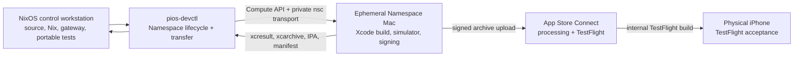

# Build and test plan: PiOS

**Status:** proposed build plan **Research date:** 2026-08-15  
**Related design:** [[architecture.md]]

In this document, **MUST**, **SHOULD**, and **MAY** are project decisions.
Factual statements about Apple, Swift, Nix, TestFlight, or hosted builders carry
an inline upstream citation.

## 1. Outcome and unavoidable platform boundary

The complete project can be developed and released **from a NixOS workstation**,
but the final native iOS build cannot execute on NixOS itself. Swift's
supported-platform matrix permits development tools running on macOS to target
Apple platforms; Swift tools running on supported Linux distributions target
Linux. Apple additionally authorizes Xcode and the Apple SDKs only on
Apple-branded hardware running macOS and expressly prohibits running them on
non-Apple-branded hardware. [SWIFT-PLATFORMS] [APPLE-XCODE-LICENSE]

The canonical setup is therefore **NixOS plus an on-demand Namespace macOS
instance**:



The NixOS machine remains the control plane and source of truth. A single
command issued there MUST create a time-limited remote Mac, send an exact source
revision, run the Apple-only build and test operations, retrieve the results,
and destroy the instance. No Mac ownership and no hosted Git provider are
required.

Namespace is suitable for this role. Its documented macOS compute runs natively
on Apple M4 Pro or M5 Max, supports Xcode/iOS builds and tests, provides
selectable macOS/Xcode image families, supports VNC, and exposes instance
creation through the Compute API. [NS-MACOS] Its CLI and API also expose TTLs,
labels, stable unique tags, private SSH access, file transfer, extension, and
explicit destruction. [NS-CREATE] [NS-SSH] [NS-UPLOAD] [NS-DOWNLOAD] [NS-EXTEND]
[NS-DESTROY]

There are two limitations to make explicit:

1. Namespace documents selectors for an image **family** such as
   `macos.version=26.x,image.with=xcode-26`, while it continuously updates those
   images. The selectors do not document an exact Xcode patch/build pin.
   [NS-MACOS] Every instance MUST therefore be inspected after creation and
   destroyed immediately if its Xcode build, SDK, Swift compiler, macOS version,
   or simulator runtime differs from `packages/ios/Config/Toolchain.env`.
2. The reviewed Namespace macOS/connection documentation exposes VNC, private
   SSH, and simulator-oriented iOS build/test support, but documents no
   USB-device passthrough from a NixOS workstation. [NS-MACOS] [NS-SSH] This
   plan therefore assumes no tethered iPhone path. Device-only acceptance occurs
   on the actual phone through an **internal TestFlight build**, after simulator
   and archive gates. A candidate that fails device acceptance is never
   promoted, even though it has already been uploaded.

This project MUST NOT support any of the following as an iOS release path:

- copying an iOS SDK into NixOS;
- `osxcross`, Darling, or a Hackintosh;
- a macOS virtual machine on non-Apple hardware; or
- treating a successful Linux Swift build as an iOS build.

Those paths either lack Xcode's complete platform toolchain or violate Apple's
stated execution restriction. [APPLE-XCODE-LICENSE] The supported boundary is a
physical or virtual macOS environment running on Apple hardware.

## 2. Canonical Namespace topology

### 2.1 Instance profile

The default development instance MUST use Namespace's documented
`macos/arm64:6x14` shape, a two-hour initial TTL, and the selectors
`macos.version=26.x,image.with=xcode-26`. Release and performance runs MAY
select `macos/arm64:12x28`. Namespace currently documents 4x7 through 12x56
macOS shapes, with per-minute billing and ephemeral storage scaled by shape;
6x14 supplies 104 GB and 12x28 supplies 160 GB. [NS-SHAPES]

The default is a project sizing choice, not a provider minimum. Measure it
during the inception spike and change it if clean Xcode builds or simulators
encounter memory pressure. At the rates published on the research date, 6x14 is
listed at $0.06 prepaid/$0.09 overage per minute and 12x28 at $0.12/$0.18; the
controller MUST treat the provider's current dashboard as authoritative rather
than embedding these prices. [NS-SHAPES]

The initial toolchain compatibility gate is:

| Input                 | Accepted value                                            |
| --------------------- | --------------------------------------------------------- |
| Xcode                 | 26.x, non-beta                                            |
| macOS on builder      | Tahoe 26.2 or later within the Xcode-supported 26.x range |
| Apple SDK             | iOS 26.x                                                  |
| Swift compiler        | 6.x                                                       |
| Swift language mode   | 6                                                         |
| App deployment target | iOS 18.0                                                  |
| Device architecture   | arm64                                                     |

Apple's matrix defines the SDK, Swift compiler, supported macOS, and deployment
ranges bundled with each Xcode release. [APPLE-XCODE-MATRIX] Qualification MUST
match the configured major-version families and record exact observed versions,
build numbers, runtime, and device type as provenance.

The instance is deliberately disposable. Source, DerivedData, local Keychains,
profiles, archives, and logs on its root disk are not durable state. Namespace
Cache Volumes MAY retain dependency and Xcode compilation caches, but never
credentials or release artifacts. Cache Volume updates use last-write-wins,
failed-instance changes are discarded, and a cache hit is not guaranteed, so
every build MUST also work from an empty cache. [NS-CACHE]

### 2.2 Provider qualification and fallback

Namespace is the canonical provider, subject to a one-time Task M0 qualification
that proves the selected image can:

- boot and pass the toolchain-family doctor;
- compile and run an iOS simulator test;
- accept a temporary signing Keychain and provisioning profile;
- archive, validate, and upload a throwaway internal TestFlight build; and
- return `.xcresult`, `.xcarchive`, `.ipa`, dSYMs, logs, and a manifest before
  destruction.

Namespace explicitly documents native iOS build/test support, but the reviewed
Namespace documentation does not explicitly promise App Store signing or
TestFlight upload. Those two release operations are therefore an
evidence-producing qualification gate, not an assumed provider feature. If
qualification fails because of a provider limitation, use another **rented
Apple-hardware** service through the same `RemoteMac` interface; buying a Mac is
not part of this plan. Xcode Cloud remains a distribution fallback because Apple
documents direct TestFlight distribution, but it is not the canonical
development environment. [APPLE-XCODE-CLOUD]

## 3. Repository contract from the first commit

The canonical repository and package layout is defined in
[[contributing.md#Repository Layout]]. Build configuration, tests, scripts,
locks, and output remain in the package that owns them.

`pios-devctl` is the Linux controller. `pios-remote` is a small, statically
linked `darwin/arm64` helper built from the same Go module and delivered as the
instance's application image. The layout follows Namespace's official `macrun`
example: cross-compile a Darwin binary, package it as an OCI layer, push it to
Namespace Container Registry by digest, call `CreateInstance`, and wait for
readiness. [NS-MACRUN] The helper is not a privileged daemon; it keeps the
development application alive, exposes only fixed build operations, and exits
when the lease ends.

The checked-in Xcode project MUST remain thin: app targets, signing,
entitlements, assets, schemes, test plans, and links to local Swift packages.
Most code lives in Swift packages so dependencies and module boundaries are
reviewable outside `project.pbxproj`. The project file, shared schemes,
`.xcconfig` files, test plans, entitlements, and SwiftPM `Package.resolved` MUST
be committed. Per-user Xcode state MUST be ignored.

`PiOSCore` contains only platform-neutral value types, Protobuf mappings,
replica reduction, command state, and deterministic utilities. It MUST build and
test on Linux and macOS. `PiOSApple` contains `URLSessionWebSocketTask`, Core
Data, Keychain, SwiftUI, local authentication, notifications, and other
Apple-framework adapters. Linux success covers only `PiOSCore`; the complete app
is always compiled and tested with Xcode.

`packages/protocol/pios.proto` is the sole editable wire definition. Generated
Swift and TypeScript sources MUST be committed so an Xcode build does not
download or bootstrap code generators. `make -C packages/protocol generate`
regenerates both outputs using Nix-pinned tools, and
`make -C packages/protocol check` fails when regeneration changes the tree.
Swift Package Manager can build and test packages on supported platforms,
including through `swift test`. [SWIFTPM]

The gateway remains a TypeScript/Node application as chosen in
[[architecture.md]]. `package-lock.json` MUST be committed and production
packaging MUST use `npm ci`, never an unconstrained install. Each Pi driver pin
records the exact upstream commit, package versions, source hash, and protocol
fixture version in `packages/gateway/upstream/pi.lock.json`; branch names such
as `main` or `dev` are never build inputs.

## 4. Reproducibility model

### 4.1 Inputs that are pinned

The following are reviewed source inputs:

- `flake.lock`, pinning Nixpkgs and every other flake input;
- `package-lock.json`, including gateway transitive dependencies;
- SwiftPM `Package.resolved`;
- Protobuf schema and exact generator versions;
- exact Pi revisions and fixed source hashes;
- Xcode version, Xcode build number, Apple SDK version, Swift compiler version,
  simulator runtime, and selected simulator device type;
- deployment target, bundle identifiers, entitlements, and build settings in
  `.xcconfig`; and
- marketing version and build number supplied explicitly to a release.

There MUST be no floating Git reference, `macos-latest` runner, automatic
package update, or Xcode-managed project migration in a normal build.

### 4.2 What Nix does and does not guarantee

`flake.nix` MUST expose:

```text
devShells.{x86_64-linux,aarch64-linux}.default
checks.{x86_64-linux,aarch64-linux}.*
packages.{x86_64-linux,aarch64-linux}.{gateway,pios-devctl,pios-remote}
nixosModules.gateway
apps.<system>.check
apps.<system>.devctl
```

The development shell pins Go, Node, npm, Swift for Linux-side package tests,
`buf`, `protoc`, the Swift and TypeScript Protobuf generators, formatters,
linters, GNU Make, Git, the official open-source `nsc` client, and
release-manifest tools. [NS-CLI-INSTALL] `buildGoModule` builds `pios-devctl`
for the local Linux system and cross-compiles `pios-remote` with
`CGO_ENABLED=0 GOOS=darwin GOARCH=arm64`. Its `vendorHash`, `go.mod`, and
`go.sum` pin the Namespace Go SDK and generated API packages. Namespace
identifies its Go SDK as its most mature SDK, with authentication and
ready-to-use Compute clients. [NS-API-SDK] [NS-GO-SDK]

The actual `xcodebuild` invocation is intentionally **not** a Nix derivation.
Xcode is part of Namespace's selected macOS image, signing consults a temporary
Keychain, simulators are mutable services, and TestFlight upload is a network
side effect. Nix pins the controller and remote helper; the development shell
exposes them for direct invocation. `packages/devctl/scripts/doctor` verifies
the provider image before any Apple build.

Reproducible here means controlled source and toolchain inputs with a recorded
provenance manifest. A signed `.ipa` is not required to be byte-for-byte
reproducible because signing and packaging introduce service- and time-dependent
data.

### 4.3 Dependency resolution

A clean online bootstrap MAY populate the Nix store, npm cache, SwiftPM checkout
cache, Xcode platform runtimes, and Pi fixtures. Normal verification then runs
from lockfiles. Release builds MUST pass these constraints:

- `npm ci` accepts the committed lock without modification;
- SwiftPM resolves exactly `Package.resolved`, after which automatic package
  resolution is disabled for build/test/archive;
- protocol generation produces no diff;
- Pi fixture hashes match `pi.lock.json`; and
- `flake.lock`, `Package.resolved`, `package-lock.json`, and generated code
  remain unchanged after the build.

An offline-after-bootstrap mode SHOULD be supported for compilation and tests.
TestFlight upload, certificate/profile refresh, and first-time dependency or
simulator downloads necessarily remain online operations.

## 5. Bootstrap

### 5.1 NixOS workstation

A human operator who is not already in a managed development environment first
enters the Nix shell:

```sh
nix develop
```

Inside that shell, including every coding-agent session, invoke the commands
directly as required by [[contributing.md#Development Environment]]:

```sh
make check
```

The first successful `make check` establishes that:

1. generated protocol code is current;
2. the gateway builds and its unit/contract tests pass;
3. `PiOSCore` builds and tests under the Linux Swift toolchain; and
4. repository formatting, lint, and static-validation gates pass.

Swift on Linux is useful for this portable subset, but it is deliberately not an
Apple-platform validation gate. [SWIFT-PLATFORMS]

### 5.2 Namespace workspace and first instance

The operator performs these one-time tasks from NixOS:

1. Create or select a Namespace workspace with macOS capacity.
2. Run the pinned `nsc login --browser=false`, open the printed URL in any
   browser, and select the workspace. Namespace documents this workstation login
   flow and the SDK's `auth.LoadUsertoken`/`auth.LoadDefaults` credential
   loading. [NS-LOGIN] [NS-GO-SDK]
3. Run `make namespace-doctor`, which authenticates without printing
   credentials, verifies workspace identity and local configuration, and
   performs no paid create operation. Actual shape capacity is proven only by
   `dev-up`; Namespace notes that shape availability depends on plan and
   remaining concurrency. [NS-CREATE]
4. Run `make dev-up`. This is the first paid action; it prints the shape,
   selectors, TTL, and purpose before asking for confirmation.
5. Run `make dev-check`, then `make dev-down`.

No Xcode, Nix installation, SSH host configuration, or provider-issued IP
address is managed manually on the remote Mac. Namespace's `nsc ssh` preserves
end-to-end encryption while keeping the target host off the public Internet.
[NS-SSH]

The remote `doctor-mac` operation MUST fail unless all recorded values match:

```text
sw_vers
uname -m
xcodebuild -version
xcrun swift --version
xcrun --sdk iphoneos --show-sdk-version
xcrun simctl list runtimes
```

It also records the Namespace instance ID, shape, selectors, deadline, and
provider image metadata; verifies that the shared scheme and test plans exist;
confirms `Package.resolved`; creates a simulator; and starts a no-signing
simulator build. Ordinary instances receive no Apple credentials.

### 5.3 Apple account setup

Simulator development does not require paid distribution membership, but
TestFlight distribution requires Apple Developer Program membership.
[APPLE-DEVELOPER-PROGRAM] Before the first device or TestFlight build, the
operator MUST:

1. enroll the owning individual or organization in the Apple Developer Program;
2. choose the permanent production bundle identifier;
3. register an explicit App ID and enable only required capabilities, initially
   Push Notifications;
4. create the matching app record in App Store Connect before upload;
5. configure the development team in uncommitted local release configuration or
   a non-secret committed team identifier;
6. export and securely retain the distribution certificate/private key,
   provisioning profile, and (for automation) a narrowly permissioned App Store
   Connect API key outside Git and the Nix store; and
7. create the internal TestFlight group and beta test information.

Apple requires an app record with an explicit App ID for an App Store Connect
provisioning profile, and Xcode can manage distribution profiles when automatic
signing is selected. [APPLE-PROVISIONING] App Store Connect requires the app
record before the first build upload. [APPLE-ASC-WORKFLOW]

## 6. One command surface

The human-facing commands run on NixOS. The root and package command contracts
are defined in [[contributing.md#Makefile Interface]]. Targets that need Apple
tooling call `pios-devctl`; the remote helper then invokes the same
package-owned scripts used by an interactive shell.

| Command                                         | Runs on                     | Contract                                                                                        |
| ----------------------------------------------- | --------------------------- | ----------------------------------------------------------------------------------------------- |
| `make -C packages/protocol generate`            | NixOS                       | Regenerate Protobuf sources and fixtures.                                                       |
| `make -C packages/ios test`                     | NixOS                       | Run all portable Swift unit and property tests.                                                 |
| `make -C packages/gateway test`                 | NixOS                       | Run gateway unit, protocol, security, and Pi-driver contract tests.                             |
| `make -C packages/devctl test`                  | NixOS                       | Run controller unit, fake-API, state-machine, and redaction tests without creating an instance. |
| `make -C packages/gateway build`                | NixOS                       | Build the production gateway deliverable.                                                       |
| `make dev-up`                                   | NixOS -> Namespace          | Create or adopt the project's development Mac after explicit cost confirmation.                 |
| `make dev-status`                               | NixOS -> Namespace          | Show instance ID, shape, image facts, deadline, commit, and dirty/sync state.                   |
| `make dev-shell` / `make dev-vnc`               | NixOS -> Namespace          | Open a private shell or Namespace VNC session on the active instance.                           |
| `make dev-extend DURATION=2h`                   | NixOS -> Namespace          | Extend within the configured maximum after confirmation.                                        |
| `make dev-down`                                 | NixOS -> Namespace          | Retrieve pending logs, destroy the exact managed instance, and clear local state.               |
| `make dev-gc`                                   | NixOS -> Namespace          | Find and destroy only expired/orphaned instances carrying this project's management labels.     |
| `make build-ios`                                | NixOS -> Namespace          | Sync the exact commit and compile the full app for the pinned simulator without signing.        |
| `make test-ios`                                 | NixOS -> Namespace          | Build once and run the pull-request test plan; retrieve `.xcresult`.                            |
| `make test-ui`                                  | NixOS -> Namespace          | Run deterministic UI and accessibility smoke tests.                                             |
| `make test-performance`                         | NixOS -> Namespace          | Run release-mode performance tests on the configured shape and recorded chip class.             |
| `make archive VERSION=... BUILD=...`            | NixOS -> one-shot Namespace | Produce and validate a signed `.xcarchive` and `.ipa`, then retrieve them.                      |
| `make upload-testflight VERSION=... BUILD=...`  | NixOS -> one-shot Namespace | Upload the already validated archive; never rebuild it.                                         |
| `make release-testflight VERSION=... BUILD=...` | NixOS -> one-shot Namespace | Create, sign, archive, validate, upload, retrieve, and destroy with cleanup on every exit.      |
| `make check-all`                                | NixOS -> Namespace          | Run local gates and add a paid Namespace simulator run.                                         |

Scripts MUST be non-interactive except for cost confirmation, first-time browser
login, and explicitly named release provisioning. They MUST preserve raw tool
logs, propagate the first failing status, redact secrets, and write structured
results under `packages/devctl/artifacts/`.

## 7. `pios-devctl`: the remote-development controller

### 7.1 Why a Go binary

This is a small Go program, not a growing shell script. Namespace publishes a
public API, generated SDKs, and a maintained Go SDK with credential management
and gRPC Compute clients. Its official macOS example calls `auth.LoadDefaults`,
`compute.NewClient`, `CreateInstance`, and `WaitInstanceSync`. [NS-API-SDK]
[NS-GO-SDK] [NS-MACRUN] The typed SDK avoids parsing human CLI output for
paid-resource lifecycle operations.

The initial implementation uses the same upstream packages as that example:
`namespacelabs.dev/integrations/auth`,
`namespacelabs.dev/integrations/api/compute`, and the generated
`buf.build/gen/go/namespace/cloud/.../compute/v1beta` messages. [NS-MACRUN]
Their exact module revisions and sums MUST be committed; upgrades are dependency
changes, not transparent provider drift.

The controller MAY execute the pinned official `nsc` binary for connection and
byte transfer. That is intentional: `nsc ssh` supplies Namespace's end-to-end
encrypted, non-public network path, and `nsc instance upload/download` are
documented file-transfer operations. [NS-SSH] [NS-UPLOAD] [NS-DOWNLOAD] It MUST
use `exec.CommandContext` with an argument vector and MUST NOT construct a shell
command string.

Provider-specific code sits behind this narrow internal interface:

```go
type RemoteMac interface {
	Up(context.Context, Spec) (Lease, error)
	Get(context.Context, InstanceID) (Lease, error)
	ListManaged(context.Context, Labels) ([]Lease, error)
	Extend(context.Context, InstanceID, time.Duration) (Lease, error)
	Destroy(context.Context, InstanceID) error
	Exec(context.Context, InstanceID, Operation) error
	Upload(context.Context, InstanceID, LocalFile, RemoteFile) error
	Download(context.Context, InstanceID, RemoteFile, LocalFile) error
}
```

The Namespace implementation uses its Go API for
`Up`/`Get`/`ListManaged`/`Extend`/`Destroy`, and the pinned `nsc` transport for
`Exec`/`Upload`/`Download`. Tests mock this interface; another rented provider
can implement it without changing build operations.

The stable CLI is:

```text
pios-devctl doctor
pios-devctl up [--role development] [--ttl 2h] [--yes]
pios-devctl status [--json]
pios-devctl sync [--include-worktree]
pios-devctl run <doctor|build-ios|test-ios|test-ui|test-performance>
pios-devctl shell
pios-devctl vnc
pios-devctl extend --duration 2h [--yes]
pios-devctl down [--yes]
pios-devctl gc [--dry-run|--apply]
pios-devctl with --operation <operation> [typed operation arguments]
pios-devctl release archive --version <semver> --build <integer>
pios-devctl release upload --version <semver> --build <integer>
pios-devctl release testflight --version <semver> --build <integer>
```

Normal output is for humans; `--json` emits a versioned envelope on standard
output while progress/logs stay on standard error. Exit codes are stable: `0`
success, `2` usage/configuration, `3` authentication/authorization, `4` provider
capacity/lifecycle, `5` toolchain mismatch, `6` remote operation failure, `7`
transfer/integrity failure, and `8` cleanup incomplete.

### 7.2 Checked-in configuration

`packages/devctl/Config/namespace.toml` contains no secrets:

```toml
schema_version = 1
workspace = ""                         # resolved from nsc login unless set locally
machine_type = "macos/arm64:6x14"
selectors = ["macos.version=26.x", "image.with=xcode-26"]
default_ttl = "2h"
maximum_ttl = "8h"
purpose = "pios native iOS development"
remote_root = "/tmp/pios"
artifact_expiry = "14d"

[release]
machine_type = "macos/arm64:12x28"
ttl = "2h"

[cache]
enabled = false
tag = "pios-xcode-v1"
minimum_size = "50gb"
mount_point = "/cache"
```

Cache starts disabled so a clean build is proven first. When enabled, only
package checkouts, DerivedData, and Xcode compilation-cache data may use it.
Namespace documents cache volumes as versioned performance storage rather than
an authoritative filesystem, including the possibility of misses or stale
versions. [NS-CACHE]

### 7.3 Authentication

For interactive use, `pios-devctl` calls the SDK's
`auth.LoadUsertoken`/`auth.LoadDefaults` after `nsc login`; the token is never
copied into repository state. [NS-GO-SDK] For unattended use, `NSC_TOKEN_FILE`
may point to a mode-`0600` file outside the checkout and Nix store. Namespace
documents revocable, expiring, permission-scoped tokens and this exact
environment variable. [NS-TOKENS]

The production implementation MUST request only instance
create/get/list/destroy/extend/access, registry push, and artifact permissions
actually exercised by tests. It MUST NOT invent a permanent workspace-admin
token, use `--no_expiry`, print token material, or pass a token in a
command-line argument. Human login is the inception default; scoped automation
tokens are enabled only after a live least-privilege test.

### 7.4 Local state and instance identity

The ignored file `packages/devctl/.state/namespace.json`, written atomically
with mode `0600`, contains only:

```json
{
  "schemaVersion": 1,
  "instanceId": "...",
  "uniqueTag": "pios-...",
  "createdAt": "...",
  "deadline": "...",
  "shape": "macos/arm64:6x14",
  "selectors": ["macos.version=26.x", "image.with=xcode-26"],
  "remoteHelperDigest": "sha256:...",
  "lastCommit": "..."
}
```

A file lock prevents two controllers from mutating the same state. Every
instance is created with a stable unique tag plus labels
`managed-by=pios-devctl`, `project=<non-secret repository UUID>`,
`role=development|release`, and `owner=<opaque local ID>`. Namespace documents
labels for programmatic filtering, a purpose field, and unique tags as stable
automation handles. [NS-CREATE]

`down` and `gc` MUST read the remote metadata before destruction and require all
management labels to match. They MUST refuse to destroy an unlabelled instance,
an instance owned by another opaque ID, or an ID supplied only as unchecked user
text.

### 7.5 Lifecycle state machine

The internal state machine is:

```text
absent -> creating -> ready -> syncing -> running -> collecting -> destroying -> absent
                     |                    |                         ^
                     +---- failed --------+-------------------------+
```

`up` performs these operations:

1. authenticate and acquire the local state lock;
2. reconcile local state with the Compute API and adopt only an exactly
   labelled, compatible instance;
3. build `pios-remote` on NixOS for `darwin/arm64`, package it in an OCI image,
   and push it by immutable digest, following Namespace's official `macrun`
   pattern; [NS-MACRUN]
4. call `CreateInstance` with `Os: "macos"`, `MachineArch: "arm64"`, configured
   vCPU/RAM, selectors, labels, documented purpose, application image digest,
   and an absolute deadline;
5. persist the returned instance ID before waiting, so a crash cannot lose the
   cleanup handle;
6. call the SDK readiness waiter with a bounded timeout; and
7. run `doctor-mac`; on any mismatch, collect diagnostics, destroy the instance,
   and return failure.

Namespace instances are ephemeral and support a creation duration/deadline,
explicit extension, and explicit destruction. [NS-CREATE] [NS-EXTEND]
[NS-DESTROY] The hard provider deadline is the last-resort cleanup if NixOS
loses power or the controller receives `SIGKILL`.

`extend` uses an ensure-minimum deadline operation, never an unbounded lease.
`down` is idempotent: a provider `not found` response clears matching local
state and succeeds. `with <operation>` installs `defer` cleanup before readiness
waiting, handles `SIGINT`/`SIGTERM`, retrieves diagnostics, and then destroys
the instance. Release operations always use `with`; they cannot adopt the
long-lived development instance.

### 7.6 Source, commands, and artifact transport

No hosted Git remote is required:

1. Resolve `HEAD`; release operations reject dirty or untracked files.
   Development operations MAY use `--include-worktree`, which produces a
   deterministic tar manifest and clearly marks the build dirty.
2. Create a Git bundle for the exact commit plus, when requested, a separately
   hashed worktree overlay.
3. Upload each file with `nsc instance upload`; Namespace documents
   local-to-instance copy and parent creation. [NS-UPLOAD]
4. On the Mac, verify SHA-256, clone into a new per-operation directory, check
   out the detached commit, apply the optional overlay, and verify the resulting
   tree hash.
5. Run only an enum-backed operation: `doctor`, `build-ios`, `test-ios`,
   `test-ui`, `test-performance`, `archive`, `upload`, or `package-artifacts`.
   Version and build number are validated typed fields. `dev-shell` is the only
   arbitrary interactive command path and is never available to release
   automation.
6. Package results without following links outside the operation directory;
   write checksums and a manifest first.
7. Download the package with `nsc instance download`, verify it on NixOS, and
   unpack under `packages/devctl/artifacts/<commit>/<operation-id>/`.
   [NS-DOWNLOAD]
8. Delete the remote operation directory. The instance root disk is discarded by
   `down` regardless.

For optional large artifact retention, the controller MAY use Namespace Artifact
Storage. Its API uses create/upload/finalize and returns a time-limited download
URL; artifacts can have an expiration date. [NS-ARTIFACTS] NixOS retrieval
remains mandatory for release archives, so provider artifact storage is not the
sole copy.

### 7.7 Cost and failure controls

- `up`, `extend`, and release commands print shape and deadline and require
  confirmation unless `--yes` is explicitly passed.
- No shell hook, editor launch, ordinary `make check`, or read-only command may
  create paid compute.
- `default_ttl` and `maximum_ttl` are parsed with upper bounds in code;
  configuration cannot request an unlimited instance.
- A shutdown failure leaves local state intact and prints the exact `dev-down`
  recovery command.
- `dev-gc --dry-run` is the default. `--apply` destroys only matching managed
  instances whose deadline passed or whose age exceeds the configured orphan
  threshold.
- Start, ready, extend, and destroy events are recorded in a local JSONL audit
  log without credentials or source paths.
- A weekly scheduled `dev-gc --apply` is recommended on the NixOS workstation,
  but the provider TTL--not that schedule--is the primary cost ceiling.

### 7.8 Controller tests

`make -C packages/devctl test` uses an in-memory fake of the narrow Compute
interface and a fake process runner. It covers create/wait failure at every
transition, atomic state recovery, duplicate `up`, mismatched labels, refusal to
delete foreign instances, deadline limits, signals, redaction, checksum failure,
command argument boundaries, and idempotent `down`.

`make test-devctl-live` is explicit and billable. It creates the smallest
configured qualification instance with a 15-minute TTL, runs
`xcodebuild -version`, uploads and downloads a random checksum fixture, tests
extension without exceeding the maximum, destroys the instance, and verifies
through the API that it is gone. It MUST run once during Task M0 and after every
Namespace SDK/API upgrade; it is not part of ordinary local tests.

## 8. Build procedures

### 8.1 Protocol generation

`make -C packages/protocol generate` performs, in order:

1. lint the schema;
2. generate the SwiftProtobuf sources;
3. generate the TypeScript sources;
4. regenerate canonical binary and JSON diagnostic fixtures;
5. compile both generated targets; and
6. write the schema SHA-256 into both products' build metadata.

Generation MUST NOT occur as an Xcode build action. A schema change is complete
only when generated code, compatibility fixtures, gateway tests, reducer tests,
and the capability mapping change together.

### 8.2 Gateway build

The gateway pipeline is fully local to NixOS and runs through its package
interface:

```sh
make -C packages/gateway check
make -C packages/gateway build
make -C packages/gateway test
```

It MUST run:

- TypeScript formatting and linting;
- strict type checking without emitting;
- unit tests;
- Protobuf malformed-input, size-limit, and round-trip tests;
- pairing/authentication and command-journal tests;
- driver contract suites against every exact Pi revision in `pi.lock.json`;
- disconnect, restart, slow-consumer, and ambiguous-delivery integration tests;
  and
- a production Node build against the locked dependency graph.

`nixosModules.gateway` MUST expose a hardened systemd service without embedding
secrets in the Nix store. Credential paths are supplied at activation/runtime
from root-owned files; secret values are never Nix expression inputs.

### 8.3 Portable Swift build on NixOS

```sh
make -C packages/ios test
```

This gate covers:

- snapshot/progress reduction and revision rules;
- reconnection and command-state machines using a fake clock;
- duplicated, missing, delayed, and cross-epoch messages;
- Protobuf DTO/domain mappings;
- bounded decoding and malformed data;
- capability negotiation; and
- deterministic property tests and fixtures.

`PiOSCore` MUST NOT import SwiftUI, UIKit, Security, Core Data,
LocalAuthentication, UserNotifications, or other Apple-only frameworks. Any
system-dependent implementation belongs behind a protocol in `PiOSApple`.

### 8.4 Full iOS simulator build

The wrapper resolves packages once from the committed lock, then executes the
equivalent of:

```sh
xcodebuild \
  -project packages/ios/PiOS.xcodeproj \
  -scheme PiOS \
  -configuration Debug \
  -destination "platform=iOS Simulator,id=$SIMULATOR_UDID" \
  -derivedDataPath "$DERIVED_DATA" \
  -clonedSourcePackagesDirPath "$SWIFTPM_CACHE" \
  -disableAutomaticPackageResolution \
  CODE_SIGNING_ALLOWED=NO \
  build
```

The script creates or reuses a simulator whose runtime and device type match
`Toolchain.env`; it never silently selects a newer runtime. Derived data is
isolated by Git commit, Xcode build number, configuration, and destination.

All configurations enable Swift 6 language mode and complete concurrency
checking. Debug builds keep assertions and diagnostics. Release builds use
optimization and emit dSYMs. Warnings are errors in project-owned targets.

### 8.5 Simulator tests

The pull-request plan uses `xcodebuild build-for-testing` once, followed by
`test-without-building`, and stores an `.xcresult` bundle. Apple supports
command-line test-plan selection and recommends combining many isolated unit
tests with fewer integration/UI tests plus dedicated performance tests.
[APPLE-TESTING] [APPLE-TEST-PLANS]

The simulator suites include:

- all portable tests under the Xcode compiler;
- transport actor, correlation, reconnect, cancellation, and backpressure tests;
- in-memory and temporary-store persistence/migration tests;
- Keychain adapter tests using isolated test access groups where supported;
- Markdown and transcript rendering fixtures;
- Dynamic Type, dark/light appearance, right-to-left layout, and
  accessibility-label checks;
- pairing, host removal, stale cache, capability downgrade, unknown delivery,
  and notification-deep-link UI flows; and
- real WSS integration against a synthetic gateway fixture on the NixOS host.

UI automation MUST use synthetic transcript/tool data and a deterministic fake
transport by default. A smaller real-network suite verifies TLS, WebSocket
framing, and gateway integration without making UI tests dependent on live Pi or
a model provider.

### 8.6 Sanitizer and performance runs

Nightly Mac checks run Address Sanitizer, Thread Sanitizer, and
undefined-behavior checks in separate supported configurations; a sanitizer
unavailable for the selected destination is reported as not applicable rather
than silently skipped.

Performance tests run on the configured Namespace performance shape, with:

- the pinned Xcode and simulator runtime;
- Release configuration;
- code coverage and sanitizers disabled;
- no concurrent builds; and
- baselines versioned by Namespace shape, reported Apple chip, macOS image, and
  Xcode build.

Namespace currently assigns M4 Pro or M5 Max processors and says M5 Max-only
allocation is available by contacting support. [NS-MACOS] Until that allocation
is enabled, M4 and M5 observations MUST remain separate; a measurement from one
chip cannot fail a baseline for the other. Correctness-oriented memory bounds
still gate every run. Absolute latency/hitch thresholds become release gates
only after M5-only allocation or another provider-level fixed hardware contract
is proven.

Apple recommends release configuration and disabling code coverage and
sanitizers when gathering performance-test metrics, and Xcode can fail tests
that regress beyond stored baselines. [APPLE-PERFORMANCE-TESTS]

Required scenarios include 10,000 transcript items, 100 progress updates per
second, multi-megabyte bounded tool results, rapid scroll, Markdown-heavy
output, repeated foreground/background transitions, cold cache migration, and
reconnect/resnapshot. The measured metrics include wall-clock time, CPU, memory
peak, hangs, launch-to-cache, launch-to-live, delta-to-render, and scroll hitch
duration.

### 8.7 Physical-device acceptance through TestFlight

A simulator cannot establish release readiness, and the Namespace Mac has no
path to the user's USB-connected iPhone. Every candidate therefore passes G0-G6,
uploads to the internal TestFlight group, and is then installed on a real iPhone
for G7. The upload is a candidate, not a promoted beta.

Device-only coverage includes:

- Keychain persistence across app termination and upgrade;
- complete file-protection behavior while the phone is locked;
- background suspension, foreground resnapshot, and network-path changes;
- APNs device-token registration and metadata-only notification delivery;
- notification deep links from terminated and background states;
- TLS trust, certificate-continuity mismatch, and re-pairing;
- biometric/passcode gates without logging sensitive results;
- VoiceOver traversal, large accessibility sizes, Reduce Motion, and hardware
  keyboard input;
- upgrade from the previous TestFlight build; and
- a long streaming session followed by review of device-visible diagnostics,
  crashes, and retained dSYM symbolication.

These are scripted manual acceptance tasks in
`packages/ios/TestPlans/TestFlightDeviceChecklist.md`; an `.xctestplan` cannot
be executed inside a distributed TestFlight app. No release test uses a
production transcript, credential, repository, or model-provider account.

## 9. Test gates and cadence

| Gate                   | Required checks                                                                                            | When it blocks                                                                       |
| ---------------------- | ---------------------------------------------------------------------------------------------------------- | ------------------------------------------------------------------------------------ |
| `G0 Linux`             | `make check`: formatting, lint, generated-code diff, gateway tests, portable Swift tests, and local builds | Every commit before it is shared                                                     |
| `G1 Apple compile`     | Clean full-app simulator compile under the pinned Xcode                                                    | Every pull request/change set                                                        |
| `G2 Apple functional`  | Unit/integration plan and deterministic UI smoke plan with `.xcresult`                                     | Every pull request/change set                                                        |
| `G3 compatibility`     | All pinned Pi driver contract suites, restart/disconnect/slow-consumer cases                               | Every Pi, protocol, gateway, or transport change                                     |
| `G4 extended`          | Sanitizer suites, complete UI plan, cache migrations, fuzz corpus                                          | Nightly and before a release candidate                                               |
| `G5 performance`       | Shape/chip-keyed release-mode baselines plus invariant memory bounds                                       | Before TestFlight when performance-sensitive code changed; otherwise at least weekly |
| `G6 distribution`      | Clean archive, signature/profile/entitlement inspection, validation, provenance manifest, upload           | Every candidate upload                                                               |
| `G7 TestFlight device` | Apple processing complete, install on a real iPhone, security/accessibility/background/push checklist      | Every candidate before promotion                                                     |
| `G8 verified beta`     | Compliance resolved, internal group enabled, device evidence retained, exact build tagged                  | Definition of a shipped beta                                                         |

CI separately evaluates and builds the flake outputs. That intrinsic Nix
validation is not part of the Makefile command interface.

There is no global line-coverage percentage. The state machines and protocol
mappings MUST instead demonstrate transition and error-case coverage: every
state, input class, capability combination, and recovery edge has an explicit
test or property. Coverage reports remain an aid for identifying omissions, not
a substitute for behavioral completeness.

## 10. Signing and secret handling

### 10.1 Development signing

Simulator builds disable signing. There is no development-signed USB-device path
in the canonical topology; real-device validation uses the distribution-signed
internal TestFlight candidate. Apple documents App Store Connect provisioning
profiles and Xcode-managed distribution profiles. [APPLE-PROVISIONING]

### 10.2 Distribution signing

Long-lived signing material is owned by the operator on NixOS, outside the
checkout and Nix store:

- an encrypted backup of the Apple Distribution identity/private key and its
  passphrase;
- the App Store Connect provisioning profile;
- the App Store Connect API private key, key ID, and issuer ID for headless
  upload; and
- the minimum non-secret team/bundle identifiers required by the project.

None of these may appear in Git, the Nix store, shell history, command output,
Namespace cache volumes, `.xcresult` attachments, or copied build manifests. Nix
store paths are not secret storage. Plaintext is materialized only inside a
mode-`0700` directory under the NixOS user's runtime tmpfs, uploaded to a fresh
release instance, and deleted locally as soon as import completes. Apple states
that the API private key is downloadable only once and must not be placed in
source repositories or client code. [APPLE-ASC-KEYS]

On the release instance, the wrapper creates a randomly named temporary
Keychain, imports only the candidate's distribution identity, installs only the
matching provisioning profile, performs the archive/validation/upload, deletes
the imported files and Keychain, and then destroys the instance. Cleanup is best
effort; instance destruction is the actual isolation boundary. Development
instances never receive these files.

The first release SHOULD use Xcode Organizer through Namespace VNC so team,
entitlements, provisioning, validation, and App Store association are visible.
Namespace documents VNC access from its dashboard and `nsc vnc`. [NS-MACOS]
After one successful manual release, `packages/devctl/scripts/upload-testflight`
MAY use a narrowly permissioned App Store Connect key and Apple's supported
upload path. Apple supports uploads through Xcode, Transporter, altool, or its
build-upload mechanisms. [APPLE-UPLOAD]

Namespace Secrets MAY later replace local secret staging for automation;
Namespace documents encryption at rest, audited access, explicit secret
requests, and API/CLI management. [NS-SECRETS] Environment-variable secret
injection is not the inception default for certificate material.

### 10.3 Untrusted code

A release instance MUST NOT execute code from untrusted pull requests. All
ordinary/PR instances are credential-free. Only a clean, protected, reviewed
commit may cause `pios-devctl` to create a one-shot `role=release` instance. The
controller imports credentials only after source verification and destroys the
instance immediately after artifact retrieval, whether the operation succeeds or
fails.

## 11. Archive and TestFlight procedure

### 11.1 Release inputs

The operator starts inside the development shell on NixOS:

```sh
make release-preflight VERSION=0.1.0 BUILD=1
make release-testflight VERSION=0.1.0 BUILD=1
```

`VERSION` is the user-facing marketing version. `BUILD` is an explicitly
allocated positive integer and MUST be unique for that bundle ID/version
combination. App Store Connect uses the bundle ID and version to associate an
upload and the build string to identify it uniquely. [APPLE-UPLOAD]

Preflight MUST verify:

- clean, committed, reviewed source;
- every required gate passed for the exact commit;
- the version/build pair has not already completed processing in App Store
  Connect;
- the Xcode pin is still accepted for uploads;
- production bundle ID, team, entitlements, privacy strings, app icon, and
  deployment target;
- no Debug entitlement, test endpoint, fixture credential, or diagnostics menu
  in Release;
- export-compliance configuration and TestFlight test notes; and
- signing identity/profile availability without printing their private material.

### 11.2 Archive once

The remote helper on the one-shot release instance executes the equivalent of:

```sh
xcodebuild \
  -project packages/ios/PiOS.xcodeproj \
  -scheme PiOS \
  -configuration Release \
  -destination 'generic/platform=iOS' \
  -derivedDataPath "$DERIVED_DATA" \
  -archivePath "$ARCHIVE_PATH" \
  -disableAutomaticPackageResolution \
  MARKETING_VERSION="$VERSION" \
  CURRENT_PROJECT_VERSION="$BUILD" \
  archive

xcodebuild \
  -exportArchive \
  -archivePath "$ARCHIVE_PATH" \
  -exportPath "$EXPORT_PATH" \
  -exportOptionsPlist packages/ios/Config/ExportOptions-Local.plist
```

Apple documents an archive as the input to distribution and supports
command-line export with `xcodebuild -exportArchive`. [APPLE-DISTRIBUTION]
[APPLE-XCODEBUILD]

The archive is built exactly once. Validation and upload MUST consume that
archive rather than triggering a second build. The wrapper verifies:

- bundle identifier, marketing version, build number, minimum OS, and embedded
  provisioning profile;
- expected entitlements and absence of unexpected entitlements;
- valid code signature;
- arm64 device slice;
- presence and UUID match of dSYMs;
- no unexpected dynamic libraries or frameworks;
- `Package.resolved`, schema hash, Pi driver pins, and Git commit in the
  provenance manifest; and
- SHA-256 hashes for the `.xcarchive`, exported `.ipa`, dSYM bundle, `.xcresult`
  bundles, logs, and manifest.

The artifacts are copied back to NixOS and retained before upload. If retrieval
or checksum verification fails, upload is refused and the release instance is
destroyed.

### 11.3 Validate and upload

For the first release, `pios-devctl` keeps the one-shot release instance alive
within its deadline and opens Namespace VNC. Open the remote `.xcarchive` in
Xcode Organizer, choose **Validate App**, inspect every warning, then choose
**Distribute App -> App Store Connect -> Upload**. Xcode's distribution workflow
creates and validates archives before upload. [APPLE-DISTRIBUTION] Namespace
documents dashboard and CLI VNC for macOS runners. [NS-MACOS]

For subsequent automated releases:

```sh
make upload-testflight VERSION=0.1.0 BUILD=1
```

The command MUST locate the existing manifest and archive on NixOS, re-check
their hashes, create a fresh one-shot release instance, upload that archive, and
use `packages/ios/Config/ExportOptions-TestFlight.plist` or Apple's supported
Transporter/altool path. It MUST refuse to build. Upload credentials are
imported into the temporary Keychain, never embedded in command arguments,
configuration, or artifacts.

Uploading is not success. Apple processes the build asynchronously before it
appears in App Store Connect, and exposes Processing, Failed, and Complete
statuses. [APPLE-BUILD-STATUS] The release remains open until its status is
Complete and all warnings have been reviewed.

### 11.4 Enable TestFlight

After processing:

1. Resolve the build's encryption/export-compliance status. Apple allows the
   applicable declaration to be represented in the app configuration or answered
   for the beta build. [APPLE-EXPORT-COMPLIANCE]
2. Add the build to the internal tester group and provide "What to Test" notes.
3. Install the build from the TestFlight app on the physical release-test
   iPhone.
4. Pair it with a staging gateway, attach to a synthetic Pi session, receive
   streaming output, background/foreground the app, reconnect, send a mutation,
   and verify that routine logs and push payloads contain no transcript data.
5. Confirm crash reports symbolicate using the retained dSYMs.
6. Mark the release manifest `testflight_verified` and create the annotated tag
   `testflight/v<VERSION>+<BUILD>`.

TestFlight builds are testable for up to 90 days. Apple supports up to 100
internal testers; external testing can reach 10,000 testers and may require
TestFlight App Review. [APPLE-TESTFLIGHT] Initial project delivery targets the
internal group. External beta distribution is a separate release approval.

## 12. Build provenance and artifacts

Every Mac build writes `build-manifest.json` containing at least:

```json
{
  "schemaVersion": 1,
  "gitCommit": "...",
  "gitTree": "...",
  "dirty": false,
  "xcodeVersion": "26.1.1",
  "xcodeBuild": "17B100",
  "swiftVersion": "6.2.1",
  "iosSdkVersion": "26.1",
  "macosVersion": "...",
  "hostArchitecture": "arm64",
  "namespaceInstanceId": "...",
  "namespaceShape": "macos/arm64:12x28",
  "namespaceSelectors": ["macos.version=26.x", "image.with=xcode-26"],
  "namespaceImage": "...",
  "appleChip": "...",
  "piosDevctlVersion": "...",
  "remoteHelperDigest": "sha256:...",
  "nscVersion": "...",
  "configuration": "Release",
  "marketingVersion": "0.1.0",
  "buildNumber": "1",
  "flakeLockSha256": "...",
  "packageResolvedSha256": "...",
  "packageLockSha256": "...",
  "protocolSchemaSha256": "...",
  "piDrivers": [],
  "testResults": [],
  "artifacts": []
}
```

The manifest records facts; it contains no usernames, home paths, hostnames,
certificate subjects, device names, tokens, session identifiers, or transcript
content. Release artifacts are immutable once uploaded. A corrected candidate
receives a new build number rather than overwriting prior output.

`.xcresult` bundles and raw logs are kept for failed and successful release
gates. Before retention or sharing, a sanitizer MUST scan them for credentials,
absolute repository paths, gateway URLs, pairing material, and transcript
fixtures. Synthetic test content is still treated as potentially sensitive until
the scan passes.

## 13. Toolchain and dependency upgrades

Toolchain upgrades are explicit pull requests:

1. Check Apple's current Xcode system-requirement/upload pages and Namespace's
   macOS image update feed. [APPLE-XCODE-MATRIX] [APPLE-UPLOAD] [NS-MACOS]
2. Create a short-lived qualification instance with the candidate selector and
   record the actual Xcode build, SDK, Swift, macOS, runtime, Namespace image,
   shape, and chip.
3. Update the accepted major-version families in `Toolchain.env` when needed.
   Record exact observed values in build provenance; Namespace selectors remain
   an image-family request.
4. Regenerate no source unless the compiler or dependency update genuinely
   requires it.
5. Run G0-G6 on the candidate. Run old and new in parallel only if Namespace
   still exposes selectors resolving to both toolchain families; the plan does
   not assume old images remain available.
6. Review warnings, concurrency diagnostics, UI golden changes, archive
   entitlements, binary size, and chip-keyed performance deltas.
7. Merge only after a complete candidate archive validates and an internal
   TestFlight build installs.
8. Retain prior archives, manifests, and dSYMs; do not claim the provider can
   recreate a retired image.

Nix, npm, SwiftPM, Protobuf, Pi-driver, and Xcode upgrades MUST be separate
commits or clearly separated changes so regressions can be attributed. Automated
dependency tools may propose updates but never merge them or change the
TestFlight build inputs automatically.

## 14. Inception-to-TestFlight tasks

### Task M0 -- build spine before product code

- Commit the flake, lockfile, root and package Makefiles, Namespace config,
  controller/remote Go module, toolchain pin, thin Xcode project, shared scheme,
  and empty test plans.
- Make `make check`, `make -C packages/devctl test`, `make test-devctl-live`,
  and `make build-ios` green.
- Exercise create, readiness, toolchain-family doctor, upload/download,
  interrupt cleanup, explicit destroy, and label-scoped garbage collection.
- Complete the Apple account prerequisites in Section 5.3 early enough to use
  the minimal app as a signing/upload proof; this intentionally front-loads the
  only undocumented part of the Namespace release path.
- Complete the provider qualification in Section 2.2, including a throwaway
  internal TestFlight upload. If signing or upload is blocked by Namespace, stop
  and implement the `RemoteMac` adapter against another rented Apple-hardware
  provider before product code.

**Exit:** a "Hello, Pi" SwiftUI app compiles in the pinned simulator and
installs from TestFlight, all from commands issued on NixOS; the Namespace
instance is confirmed destroyed afterward.

### Task M1 -- stable protocol and gateway skeleton

- Add Protobuf generation and drift checks.
- Package the gateway as a Nix derivation and NixOS module.
- Add synthetic WSS integration and generated Swift/TypeScript round trips.

**Exit:** the simulator app and NixOS gateway complete hello/list/attach using
fixtures without live Pi.

### Task M2 -- state and rendering correctness

- Implement `PiOSCore` reducer and property tests on NixOS.
- Implement Apple transport, persistence, security, and UI adapters.
- Establish UI, accessibility, migration, and large-transcript test suites.

**Exit:** G0-G4 pass and the simulator survives all snapshot/progress/reconnect
cases.

### Task M3 -- real Pi contract

- Freeze the selected Pi revisions.
- Run gateway driver contract tests against real upstream servers.
- Run an end-to-end test from the Namespace simulator and a TestFlight-installed
  iPhone through the staging gateway to a synthetic repository/session.

**Exit:** G3 passes without production credentials or data; the device portion
is repeated in G7 on the release candidate.

### Task M4 -- release infrastructure

- Finalize the production App ID/app record, signing material, APNs, TestFlight
  group, and export-compliance data first exercised by the Task M0 qualification
  app.
- Produce the first remotely validated archive and provenance manifest.
- Perform a disaster-recovery rehearsal on a fresh one-shot Namespace instance
  using backed-up signing material and this document.

**Exit:** G6 passes and the archive is uploadable without changing source or
project settings in Xcode.

### Task M5 -- TestFlight

- Upload the exact validated archive.
- Wait for Complete status, resolve compliance, add the internal group, install,
  and run the TestFlight smoke checklist.
- Tag and retain the verified artifacts.

**Exit:** G8 passes. The user can reproduce the release beginning from NixOS
without relying on another person's machine or account.

## 15. Acceptance criteria for the build system

The build system is complete only when:

1. `make check` passes from a clean NixOS clone inside the development shell.
2. The gateway is produced as a Nix package and can be enabled through the
   repository's NixOS module.
3. All platform-neutral Swift logic builds and tests on NixOS.
4. One documented NixOS command creates a Namespace Mac, builds and tests the
   full native app, retrieves results, and destroys the instance.
5. The remote doctor rejects an unpinned Xcode build, SDK, simulator runtime,
   Swift compiler, Namespace image, SwiftPM resolution, or release source tree.
6. A fresh Namespace instance needs no manual machine bootstrap; the selected
   provider image supplies Xcode and release credentials are temporary operation
   inputs only.
7. No hosted CI or hosted Git provider is required; Apple-only execution uses
   Namespace and distribution uses Apple's services, while dependency downloads
   remain lockfile-controlled bootstrap inputs.
8. No unsupported non-Apple build path is required or accepted.
9. Release credentials never enter Git, Nix derivations, logs, or ordinary
   builder jobs.
10. Every TestFlight upload is traceable to one clean commit, test-result set,
    archive, manifest, and immutable artifact hash.
11. The uploaded archive--not a rebuild--installs from TestFlight and passes the
    physical-device smoke test.
12. A lost NixOS process cannot leave an unlimited instance: every instance has
    a provider deadline, matching labels, recoverable state, idempotent destroy,
    and tested garbage collection.
13. `make test-devctl-live` proves create, wait, private access, transfer,
    extend, and destroy against the pinned Namespace SDK before product work and
    after SDK upgrades.
14. Replacing Namespace with another rented Apple-hardware provider changes the
    `RemoteMac` adapter, not the repository operations, tests, or release gates.

## Sources

[APPLE-XCODE-LICENSE]: https://www.apple.com/legal/sla/docs/xcode.pdf
[APPLE-XCODE-MATRIX]: https://developer.apple.com/xcode/system-requirements
[APPLE-DEVELOPER-PROGRAM]: https://developer.apple.com/programs/
[APPLE-PROVISIONING]:
  https://developer.apple.com/help/account/provisioning-profiles/create-an-app-store-provisioning-profile
[APPLE-ASC-WORKFLOW]:
  https://developer.apple.com/help/app-store-connect/get-started/app-store-connect-workflow
[APPLE-ASC-KEYS]:
  https://developer.apple.com/documentation/appstoreconnectapi/creating-api-keys-for-app-store-connect-api
[APPLE-TESTING]: https://developer.apple.com/documentation/xcode/testing
[APPLE-TEST-PLANS]:
  https://developer.apple.com/documentation/xcode/organizing-tests-to-improve-feedback
[APPLE-PERFORMANCE-TESTS]:
  https://developer.apple.com/documentation/xcode/writing-and-running-performance-tests
[APPLE-DISTRIBUTION]:
  https://developer.apple.com/documentation/xcode/distributing-your-app-for-beta-testing-and-releases
[APPLE-XCODEBUILD]:
  https://developer.apple.com/library/archive/technotes/tn2339/_index.html
[APPLE-UPLOAD]:
  https://developer.apple.com/help/app-store-connect/manage-builds/upload-builds/
[APPLE-BUILD-STATUS]:
  https://developer.apple.com/help/app-store-connect/manage-builds/view-builds-and-metadata/
[APPLE-EXPORT-COMPLIANCE]:
  https://developer.apple.com/help/app-store-connect/test-a-beta-version/provide-export-compliance-information-for-beta-builds/
[APPLE-TESTFLIGHT]:
  https://developer.apple.com/help/app-store-connect/test-a-beta-version/testflight-overview/
[APPLE-XCODE-CLOUD]:
  https://developer.apple.com/documentation/xcode/distributing-your-xcode-cloud-builds-through-testflight
[SWIFT-PLATFORMS]: https://www.swift.org/platform-support/
[SWIFTPM]: https://docs.swift.org/swiftpm/documentation/packagemanagerdocs/
[NS-MACOS]: https://namespace.so/docs/architecture/compute/macos
[NS-SHAPES]: https://namespace.so/docs/architecture/compute/machine-shapes
[NS-API-SDK]: https://namespace.so/docs/reference/api-sdk
[NS-GO-SDK]: https://github.com/namespacelabs/integrations
[NS-MACRUN]:
  https://github.com/namespacelabs/integrations/blob/main/examples/macrun/macrun.go
[NS-CLI-INSTALL]: https://namespace.so/docs/reference/cli/installation
[NS-CREATE]: https://namespace.so/docs/reference/cli/create
[NS-DESTROY]: https://namespace.so/docs/reference/cli/destroy
[NS-EXTEND]: https://namespace.so/docs/reference/cli/extend
[NS-SSH]: https://namespace.so/docs/reference/cli/ssh
[NS-UPLOAD]: https://namespace.so/docs/reference/cli/instance-upload
[NS-DOWNLOAD]: https://namespace.so/docs/reference/cli/instance-download
[NS-LOGIN]: https://namespace.so/docs/reference/cli/login
[NS-TOKENS]: https://namespace.so/docs/reference/cli/token-create
[NS-CACHE]: https://namespace.so/docs/architecture/storage/cache-volumes
[NS-ARTIFACTS]: https://namespace.so/docs/architecture/storage/artifact-storage
[NS-SECRETS]: https://namespace.so/docs/architecture/storage/secrets
